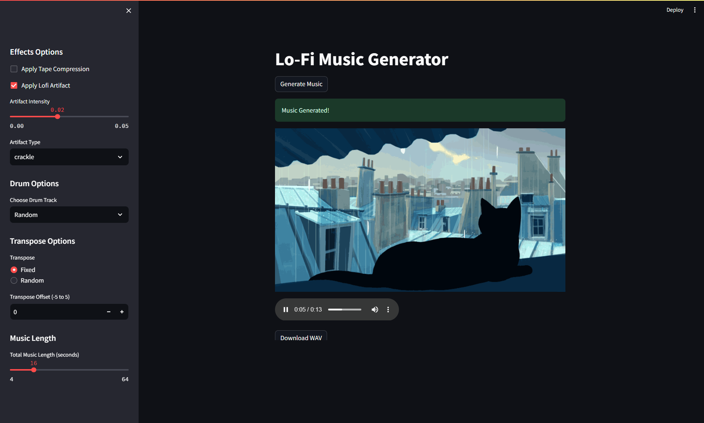

# Evolutionary Lo-Fi Music Generator

Generate unique Lo-Fi tracks with effects using an evolutionary algorithm, controlled via a Streamlit web UI. Features CI/CD integration via Jenkins and Docker.

## Core Features

*   **Evolutionary Melody Generation:** Creates unique melodies via genetic algorithms.
*   **Streamlit Web UI:** Interactive interface for generation and parameter control.
*   **Lo-Fi Effects:** Apply tape saturation and vinyl/fire crackle.
*   **Rhythm Section:** Includes synthesized chords and selectable drum patterns.
*   **Customization:** Adjustable track length and transposition.
*   **Dockerized:** Easy setup and deployment via Docker.
*   **CI/CD Pipeline:** Automated build, testing (`pytest`), and deployment using Jenkins (`Jenkinsfile`).

## Tech Stack

*   **Python:** Core logic and web app.
*   **Libraries:** Streamlit, NumPy, Librosa, SoundDevice, PyAudio, Wave, Pytest.
*   **Containerization:** Docker
*   **CI/CD:** Jenkins

## Quick Start (Docker - Recommended)

1.  **Clone:**
    ```bash
    git clone https://github.com/AnshulPatil29/Evolutionary-Music-Generator.git
    cd Evolutionary-Music-Generator
    ```
2.  **Build:**
    ```bash
    docker build -t evolutionary-music-generator .
    ```
3.  **Run:**
    ```bash
    docker run --rm -p 8501:8501 --name music-generator-container evolutionary-music-generator
    ```
4.  **Access:** Open your browser to `http://localhost:8501`.

## Local Setup (Alternative)

1.  **Prerequisites:** Python 3.9, Git, PortAudio development libraries (OS-dependent install).
2.  **Clone:** `git clone https://github.com/AnshulPatil29/Evolutionary-Music-Generator.git && cd Evolutionary-Music-Generator`
3.  **Setup Env (Recommended):** `python -m venv venv && source venv/bin/activate` (or `venv\Scripts\activate` on Windows)
4.  **Install Deps:** `pip install -r requirements.txt`
5.  **Run App:** `streamlit run app.py`

## Usage

1.  Run the application (Docker or Local).
2.  Use the sidebar in the web UI to configure effects, drums, transpose, and length.
3.  Click "Generate Music".
4.  Listen using the built-in player and download the WAV file.

## UI


## CI/CD

The included `Jenkinsfile` defines an automated pipeline that:
*   Builds the Docker image upon pushes to `main`.
*   Runs `pytest` tests within the container.
*   Deploys the container by stopping the old one and starting the new one (if tests pass).
